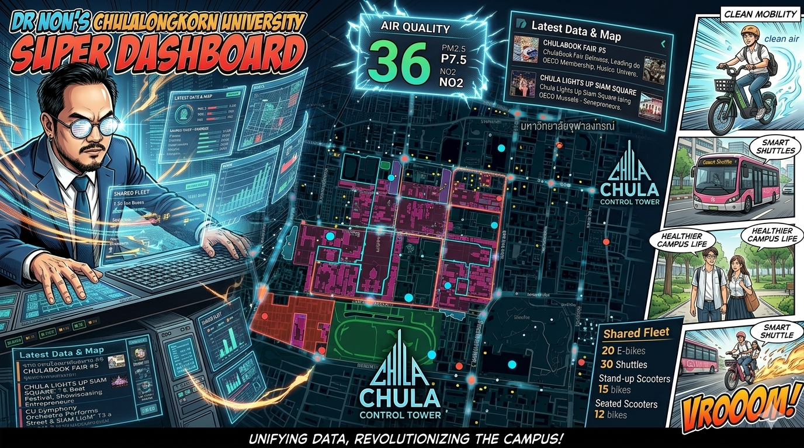

# Chula Control Tower



Single-area control-tower dashboard for **Chulalongkorn University main campus** and the surrounding CU lands in Bangkok (Siam Square, Samyan Mitrtown, Chamchuri Square, Stadium One, MBK, Suan Luang, Centenary Park, Chula Hospital).

Pulls real-time traffic, citizen reports, news, satellite imagery, air quality, CCTV, transit, and BMA points-of-interest. Designed for a Bauhaus + LCARS engineer aesthetic.

## Origin

> *"Dr Non — show me your dashboard."*

That was the ask, more or less. Someone in charge at Chula wanted to see what I'd been building. The polite move would have been to point at a few of the existing dashboards lying around — there are plenty — and call it a day. I didn't feel like that.

If he wants to see **his** dashboard — not a dashboard, not a generic dashboard, **his** — then I'm going to build him one. From scratch. Over a weekend. The way I actually work when no one's watching: ninja style.

That meant:

- **One screen, one campus.** Not a portfolio, not a tour, not a slide deck. A single live surface that says *"this is Chula right now."* Traffic, citizen complaints, air quality, hospital flows, CCTV, BMA points-of-interest, transit, satellite — everything Chula's footprint actually intersects with, on one map, talking to each other.
- **Real data only.** No mockups. BMA ArcGIS, BMA Open Data, Open-Meteo, iTIC/Longdo traffic, Traffy Fondue, Longdo CCTV — 35+ live sources stitched together. If something can't be wired to a real endpoint, it doesn't ship.
- **Run it from my Mac.** Cloudflare tunnel to `chula-api.nonarkara.org`, web statically hosted on Cloudflare Pages, launchd keeping the API alive 24/7 on the M3. Zero-cost infra, zero excuses, zero "let me get back to you on procurement."
- **Bauhaus + LCARS.** No corporate chrome, no rounded gradient cards. Modular grid, monospace labels, route colours, honest information design. The aesthetic of someone who actually wants you to read the screen.

The image at the top is the dream of it — Dr Non in front of the wall of glass, the campus laid out like a circuit, every data source feeding in. The code in this repo is the working version of that picture. Same campus, same intent, fewer comic-book sparks.

**Why bother?** Because the gap between "we have data" and "we can act on the data" is the gap public-service infrastructure lives or dies in. A control tower for one campus is the smallest honest unit to prove the gap can be closed. Close it here, and the same pattern works for a city — and after that, a country.

That's the pitch. The rest of this README is how it's wired.

## Repo layout

```
chula-control-tower/
├── apps/
│   ├── web/      # Vite + React 19 + Deck.gl + MapLibre (static, deploys to Cloudflare Pages)
│   └── api/      # Hono (dual-runtime: Cloudflare Workers + Node)
├── packages/
│   └── shared/   # types, locale, campus config, source catalog
└── infra/
    └── org.nonarkara.chula-api.plist   # launchd unit for the Node API
```

## Runtime

| Component | Where it runs | How |
|---|---|---|
| **Web** (static) | Cloudflare Pages | `pnpm --filter @chula/web build && wrangler pages deploy dist` |
| **API** (live data) | This Mac, port 8787 | launchd `org.nonarkara.chula-api` → `tsx src/node.ts` |
| **Public API URL** | `https://chula-api.nonarkara.org` | Cloudflare Tunnel (PM2 `city-reporter-tunnel`) → localhost:8787 |
| **Public web URL** | `https://chula.nonarkara.org` | Cloudflare Pages custom domain |

The API runs as Node (not Workers) because workerd's BoringSSL TLS rejects some Thai gov endpoints (bmagis.bangkok.go.th, data.bangkok.go.th). Node uses OpenSSL and reaches them cleanly. Same Hono code works in both runtimes; Workers entry is `src/index.ts`, Node entry is `src/node.ts`.

## Data sources (35+, see `/api/sources`)

| Live now | What it gives us |
|---|---|
| **BMA ArcGIS** `bmagis.bangkok.go.th` | 107+ POIs in campus bbox: hospitals, fire, police, health centers, BMA offices, markets, parks, pump stations, flood gates |
| **BMA Open Data** `data.bangkok.go.th` | 59 keyword-discovered datasets (markets, traffic 2569, green space, …) |
| **Open-Meteo** | Weather + Air-Quality with 8h forecast (powers the persistent AQI badge) |
| **iTIC / Longdo** | Live traffic events (accidents, closures, congestion) |
| **Traffy Fondue** | Citizen complaints (Bangkok-wide, bbox-filtered) |
| **Longdo Cameras** | CCTV feeds (bbox-filtered) |
| **NASA GIBS** | Free WMTS tiles: MODIS true-color, 8-day NDVI |
| **Google News + Bangkok Post RSS** | Chula/Siam/Samyan keyword news, 5-min cache |

Static fallbacks for BMA POIs ship in `apps/web/public/geo/bma/` for resilience.

## Local dev

```bash
pnpm install
pnpm --filter @chula/api dev:node    # Node API at http://localhost:8787
pnpm --filter @chula/web dev          # Vite at http://localhost:5173 (proxies /api → 8787)
```

## Manage the live API

```bash
# Status
launchctl list | grep chula-api
tail -f var/api.out.log

# Stop / start
launchctl bootout  gui/$(id -u) ~/Library/LaunchAgents/org.nonarkara.chula-api.plist
launchctl bootstrap gui/$(id -u) ~/Library/LaunchAgents/org.nonarkara.chula-api.plist
```

## Deploy the web (when Cloudflare auth lands)

```bash
cd apps/web
pnpm exec wrangler login         # one-time, browser flow
pnpm build
pnpm exec wrangler pages deploy dist --project-name chula-control-tower
# Then attach custom domain chula.nonarkara.org in the Pages dashboard or via:
# pnpm exec wrangler pages deployment tail
```

## Status

v0.1 — campus + CU lands wired, 12 map layers, 5 lens presets, prominent AQI badge, source catalog, Node API live behind Cloudflare Tunnel, web build green. Pending: Cloudflare Pages deploy (auth blocked).
